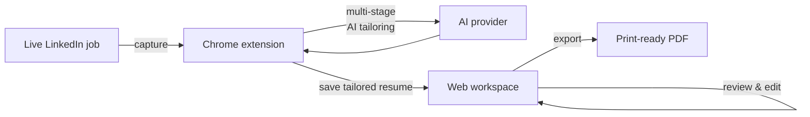
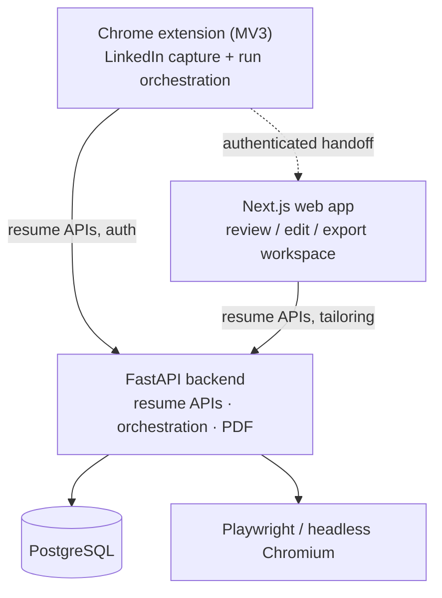

# Lumi Coach

**Tailor your resume to any LinkedIn job in a few clicks — capture the role, let AI draft a targeted resume, then review and export it in a clean web workspace.**


[](LICENSE)
[](https://chromewebstore.google.com/detail/lumi-coach/iklflomjpppjfkaegdimkgabancffdhb)

<!-- TODO: add a Lumi Coach hero screenshot or GIF of the LinkedIn → tailor → review flow here,
     e.g. . -->

**[Install from Chrome Web Store](https://chromewebstore.google.com/detail/lumi-coach/iklflomjpppjfkaegdimkgabancffdhb)** · **[Open the Web App](https://som-career-coach-iota.vercel.app/)** · **[Privacy Policy](https://som-career-coach-iota.vercel.app/privacy)**

---

## What is Lumi Coach?

Lumi Coach is an AI-powered resume tailoring platform built around a simple workflow: **start from a live LinkedIn job, generate a targeted resume, then review and refine the result in the web workspace.** You keep one master resume; Lumi Coach adapts it to each role instead of making you rewrite from scratch.

It has three parts:

- a **Chrome extension** that captures the job straight from LinkedIn and runs the tailoring — this is the main entry point;
- a **Next.js web app** for reviewing, editing, previewing, and exporting the tailored resumes;
- a **FastAPI backend** for resume APIs, PDF generation, and orchestration support.

## How it works



1. Upload or create your master resume.
2. Open a live LinkedIn job posting.
3. Launch Lumi Coach from the extension.
4. Run the tailoring workflow (queue several jobs if you like).
5. Review the generated resume in the Lumi Coach workspace.
6. Export the final PDF.

## Features

- **LinkedIn-triggered tailoring** — start from a real job page instead of copy-pasting descriptions between tabs.
- **Multi-step AI orchestration** — structured prompt chaining analyzes the role, positions the candidate, and drafts the resume.
- **Multi-provider AI** — bring your own key for OpenAI, Anthropic, Google, DeepSeek, and more (via LiteLLM), or drive a provider's web UI.
- **Parallel run queue** — queue multiple jobs and tailor several at once, tracked in a Runs tab.
- **Resume workspace** — review, edit, rename, preview, and manage tailored resumes in the web app.
- **PDF export** — print-ready output with configurable template and page settings.
- **Privacy-first** — extension data and any saved provider keys stay local to your browser (see [Privacy](#privacy)).

## Architecture



| Component | Role | Stack |
|-----------|------|-------|
| [`apps/chrome-extension`](apps/chrome-extension) | **Primary product** — captures the LinkedIn job and runs tailoring; syncs results to the workspace | Chrome Extension (Manifest V3) |
| [`apps/frontend`](apps/frontend) | Companion **review/edit workspace** for tailored resumes | Next.js 16, React 19, TypeScript, Tailwind CSS v4 |
| [`apps/backend`](apps/backend) | Resume APIs, AI orchestration support, and PDF generation | FastAPI, Python 3.13+, LiteLLM, PostgreSQL (SQLAlchemy), Playwright |

```text
apps/
├── backend/           FastAPI API, orchestration, PDF rendering
├── frontend/          Next.js web app
└── chrome-extension/  LinkedIn workflow extension (primary product)

docs/                  Architecture, design, deployment, and agent docs
assets/                Repository assets
```

## Getting started (self-host / development)

> For everyday use you don't need to run anything — just [install the extension](https://chromewebstore.google.com/detail/lumi-coach/iklflomjpppjfkaegdimkgabancffdhb) and [open the web app](https://som-career-coach-iota.vercel.app/). This section is for running Lumi Coach locally.

**Prerequisites:** Python 3.13+, Node.js 22+, and [`uv`](https://docs.astral.sh/uv/).

```bash
git clone https://github.com/kenn-nguyen/Lumi-Coach.git
cd Lumi-Coach

# Backend  →  http://localhost:8000
cd apps/backend
cp .env.example .env
uv sync
uv run uvicorn app.main:app --reload --port 8000

# Frontend  →  http://localhost:3000   (separate terminal)
cd apps/frontend
cp .env.sample .env.local
npm install
npm run dev
```

**Chrome extension:** open Chrome's extension management, enable developer mode, and *Load unpacked* → select [`apps/chrome-extension`](apps/chrome-extension).

Full setup details, environment variables, and first-run configuration are in **[SETUP.md](SETUP.md)**.

## Configuration

Lumi Coach supports multiple AI providers through [LiteLLM](https://github.com/BerriAI/litellm). In the web app's **Settings** (or the extension's settings), choose a provider (OpenAI, Anthropic, Google, DeepSeek, …), add your API key, and run **Test Connection**. See [`docs/agent/llm-integration.md`](docs/agent/llm-integration.md) for the provider model and advanced per-stage routing.

## Documentation

Developer and architecture documentation lives under [`docs/`](docs). Start with the index:

- **[docs/agent/README.md](docs/agent/README.md)** — canonical documentation index (architecture, APIs, design system, features)
- [docs/agent/quickstart.md](docs/agent/quickstart.md) — local setup and first run
- [docs/agent/architecture/](docs/agent/architecture) — backend & frontend architecture
- [docs/agent/design/style-guide.md](docs/agent/design/style-guide.md) — the Swiss International Style design system

## Deployment

- **Backend on Render** — see [docs/deploy/render-backend.md](docs/deploy/render-backend.md) and [`render.yaml`](render.yaml).
- **Docker** — [`Dockerfile`](Dockerfile) and the `docker-compose*.yml` files at the repo root cover containerized runs.

## Contributing

Contributions are welcome. Please:

- open an issue or discussion for bugs and feature ideas (templates in [`.github/`](.github));
- read the [Contributing guide](.github/CONTRIBUTING.md) and [Code of Conduct](.github/CODE_OF_CONDUCT.md);
- follow the repo conventions in [`AGENTS.md`](AGENTS.md);
- run `npm run lint` and `npm run format` before submitting frontend changes.

## Privacy

Lumi Coach supports authenticated resume tailoring workflows across the web app and Chrome extension.

- Extension-local data stays on your browser unless a feature explicitly sends it to Lumi Coach services or the AI provider you selected.
- Saved provider API keys in the extension are **not** uploaded just because they are stored locally.
- Account switching in the extension uses isolated local workspaces.

Read the full policy: [Privacy Policy](https://som-career-coach-iota.vercel.app/privacy).

## Credits & attribution

Lumi Coach began as a fork of [**Resume Matcher**](https://github.com/srbhr/Resume-Matcher) by [srbhr](https://github.com/srbhr) and its contributors — sincere thanks for the open-source starting point.

To be clear about what is what:

- **Inherited from Resume Matcher:** parts of the FastAPI backend scaffold (resume storage APIs, PDF rendering) and some of the Next.js editing foundation.
- **Built for Lumi Coach (new work):** the entire **Chrome extension** — LinkedIn capture, run orchestration, and the parallel tailoring queue — plus the **multi-stage AI tailoring** pipeline, **per-user multi-provider routing**, and the redesigned **review workspace**. These are the core of the product and are original to this repository.

## License

Licensed under the Apache License 2.0. See [LICENSE](LICENSE) for details.
